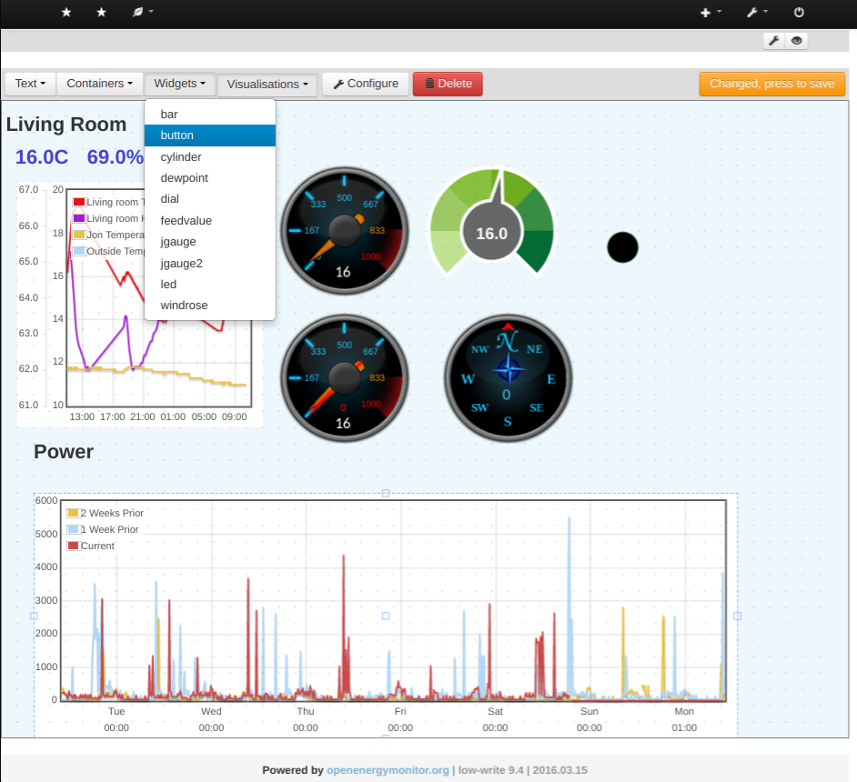

# Emoncms Dashboard Module

[](https://www.codacy.com/app/emoncms/dashboard?utm_source=github.com&amp;utm_medium=referral&amp;utm_content=emoncms/dashboard&amp;utm_campaign=Badge_Grade)

## Install 

```
$ cd /var/www/emoncms/Modules
$ git clone https://github.com/emoncms/dashboard
```

Login to Emoncms then run:  Admin > Check for database updates

## Update 

```
$ cd /var/www/emoncms/Modules/dashboard
$ git pull origin master
```

Drag'n drop visual custom dashboard builder for Emoncms




Credit to [smitt1979](https://openenergymonitor.org/emon/node/11593) for the second excellent dashboard example. See [Emoncms dashboard showcase forum](https://openenergymonitor.org/emon/forum/7) for more examples. 
